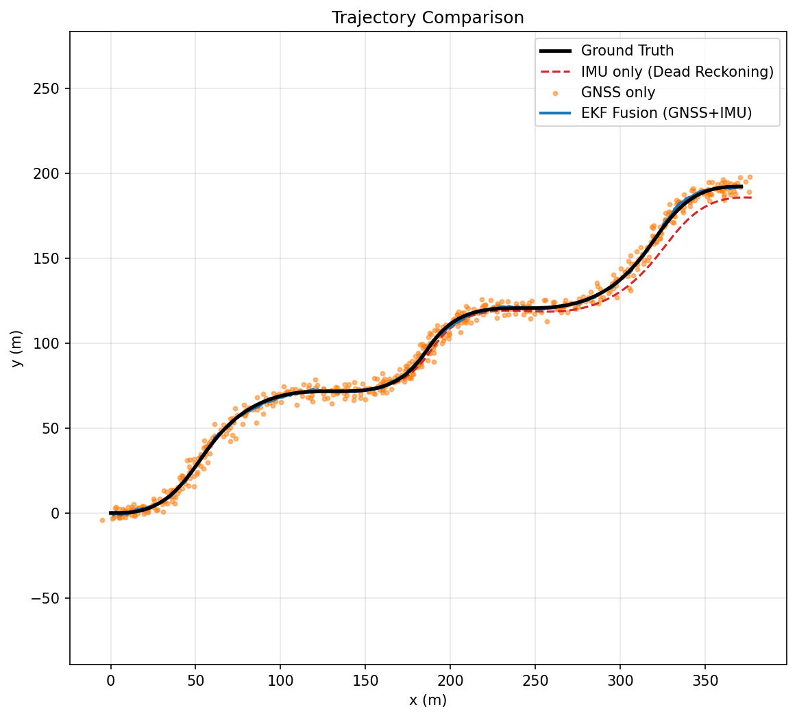

# GNSS + IMU 기반 차량 위치 추정 (Extended Kalman Filter)

IMU 단독(Dead Reckoning), GNSS 단독, 그리고 **Extended Kalman Filter(EKF)를 이용한 GNSS+IMU 융합** 세 가지 방식의 차량 위치 추정 성능을 직접 구현하고 비교하는 프로젝트입니다. 필터 로직은 라이브러리에 의존하지 않고 NumPy로 직접 구현했습니다.

## 진행 상태

- [x] IMU 단독 Dead Reckoning
- [x] GNSS 단독 위치 추정 (노이즈 시뮬레이션)
- [x] EKF 기반 GNSS+IMU 융합
- [x] 정량 평가 (RMSE) 및 궤적 시각화
- [ ] 실제 KITTI 시퀀스로 검증 (현재는 합성 데이터로 파이프라인 검증 완료)

## 프로젝트 배경

자율주행 차량의 위치 추정(Localization)은 경로 계획, 제어 등 상위 모듈의 기반이 되는 핵심 문제입니다. 단일 센서만으로는 다음과 같은 한계가 있습니다.

- **IMU 단독**: 가속도/각속도를 적분하는 방식이라 단기적으로는 정확하지만, 시간이 지날수록 오차가 누적되어 발산합니다.
- **GNSS 단독**: 절대 위치 기준을 제공하지만, 순간적인 노이즈나 멀티패스로 인해 궤적이 튀는 현상이 발생합니다.

이 프로젝트는 두 센서를 EKF로 융합했을 때, 각 센서의 단점을 상호 보완하여 더 안정적이고 정확한 궤적을 얻을 수 있음을 직접 구현하고 정량적으로 검증합니다.

## 상태공간 및 EKF 수식

### 상태 벡터

$$
x = [x, y, \psi, v]^T
$$

- $x, y$: 로컬 평면 좌표 (m)
- $\psi$: yaw (heading, rad)
- $v$: 전진 속도 (m/s)

### 예측 단계 (Prediction, IMU 기반)

$$
\begin{aligned}
x_{k+1} &= x_k + v_k \cos(\psi_k)\,\Delta t \\
y_{k+1} &= y_k + v_k \sin(\psi_k)\,\Delta t \\
\psi_{k+1} &= \psi_k + \omega_k\,\Delta t \\
v_{k+1} &= v_k + a_k\,\Delta t
\end{aligned}
$$

$P_{k+1|k} = F_k P_k F_k^T + Q$, 여기서 $F_k$는 위 비선형 모델의 상태에 대한 자코비안.

### 업데이트 단계 (Update, GNSS 기반)

$$
z_k = H x_k + v_k, \quad H = \begin{bmatrix} 1 & 0 & 0 & 0 \\ 0 & 1 & 0 & 0 \end{bmatrix}
$$

$$
K_k = P_{k|k-1} H^T (H P_{k|k-1} H^T + R)^{-1}, \quad
x_k = x_{k|k-1} + K_k (z_k - H x_{k|k-1}), \quad
P_k = (I - K_k H) P_{k|k-1}
$$

- $Q$: 프로세스 노이즈 (IMU 신뢰도) — `src/ekf.py` 기본값: 위치 0.05m, yaw 0.5°, 속도 0.1m/s 수준
- $R$: 관측 노이즈 (GNSS 신뢰도) — 기본값: 3m std (일반 소비자용 GNSS 수준)

## 데이터 및 노이즈 모델에 대한 중요한 참고사항

KITTI OXTS 데이터는 이미 RTK/IMU로 보정된 **고정밀 융합 출력**이며, 별도의 raw/noisy GNSS 스트림을 제공하지 않습니다. 따라서:

- OXTS의 위치(lat/lon → 로컬 좌표 변환)를 **Ground Truth**로 사용
- 여기에 **가우시안 노이즈를 합성 주입**하여 일반 소비자용 GNSS 수신기를 모사한 "GNSS 관측치"를 생성 (`src/sensor_sim.py::add_gnss_noise`)
- IMU 채널(전진가속도 `af`, yaw rate `wu`)은 데이터셋의 실제 IMU 값을 그대로 사용

이 부분은 실제 raw GNSS 로그(u-blox 등)를 구할 수 있다면 그대로 대체 가능하도록 설계했습니다 (`main.py`의 `add_gnss_noise` 호출부만 실제 GNSS 데이터로 교체하면 됨).

## 프로젝트 구조

```
gnss-imu-ekf-localization/
├── main.py                  # 실행 진입점 (synthetic / kitti 모드)
├── requirements.txt
├── src/
│   ├── ekf.py                # EKF 클래스 (predict/update)
│   ├── dead_reckoning.py      # IMU 단독 적분
│   ├── kitti_loader.py        # KITTI raw OXTS 파서 (lat/lon → 로컬 좌표 변환 포함)
│   ├── sensor_sim.py          # GNSS/IMU 노이즈 시뮬레이션, 합성 궤적 생성
│   └── evaluate.py            # RMSE 계산 및 궤적 시각화
└── outputs/                   # 실행 결과 (RMSE 표, 궤적 그래프)
```

## 실행 방법

```bash
git clone https://github.com/<username>/gnss-imu-ekf-localization.git
cd gnss-imu-ekf-localization
pip install -r requirements.txt

# 1) 합성 데이터로 빠르게 파이프라인 검증 (KITTI 다운로드 불필요)
python main.py --mode synthetic

# 2) 실제 KITTI raw 시퀀스 사용 시
python main.py --mode kitti --seq_dir /path/to/2011_09_26_drive_0005_sync
```

## 실험 결과 (합성 데이터 기준)

아래는 `python main.py --mode synthetic` 실행 결과입니다. (S자 곡선 주행 궤적, GNSS 노이즈 std=3m 가정)

### 궤적 비교



- **IMU 단독**: 초반에는 GT와 유사하지만 시간이 지날수록 오차가 누적되어 커브 구간에서 점점 벗어남
- **GNSS 단독**: 전체적인 경로는 따라가지만 지점마다 노이즈로 인해 궤적이 흔들림
- **EKF 융합**: 두 센서의 장점을 결합하여 GT와 가장 근접하고 부드러운 궤적 생성

### RMSE 비교

| 방법 | RMSE (m) |
|---|---|
| IMU 단독 (Dead Reckoning) | 4.471 |
| GNSS 단독 | 4.181 |
| **EKF 융합** | **0.907** |

EKF 융합이 단일 센서 대비 RMSE를 약 **4.6배** 개선했습니다.

> 실제 KITTI 시퀀스로 실행한 결과는 `--mode kitti`로 재현 후 이 표를 갱신할 예정입니다.

## 배운 점

- IMU 적분 오차는 시간에 대해 누적되므로, 짧은 구간에서는 정확하지만 장시간 사용 시 발산한다는 것을 직접 확인함
- GNSS는 절대 위치 기준을 제공하지만 순간적인 노이즈에 취약하며, 단독 사용 시 궤적이 불안정함
- EKF는 공분산($Q$, $R$)을 기반으로 두 센서를 자동으로 가중 융합하며, 이 두 값의 상대적 크기가 "IMU를 더 믿을지 GNSS를 더 믿을지"를 결정한다는 점을 체감함
- 혈압 추정 연구에서 다루었던 다중 신호 융합(Bi-GRU 기반 특징 융합) 구조와 유사하지만, 이번에는 확률적 모델(칼만 필터) 기반의 명시적 융합 방식을 경험함

## 한계 및 개선 방향

- 현재 모델은 등속/등각속도 가정을 사용한 단순 운동 모델로, 급격한 조향/가감속 구간에서는 오차가 커질 수 있음
- GNSS 노이즈를 고정 표준편차로 가정했으나, 실제로는 위성 수신 상태(HDOP 등)에 따라 동적으로 조정하는 Adaptive EKF로 확장 가능
- 향후 UKF(Unscented Kalman Filter), Particle Filter와의 성능 비교나 LiDAR/카메라 관측치 추가 융합으로 확장 가능

## 참고 자료

- [KITTI Raw Dataset](http://www.cvlibs.net/datasets/kitti/raw_data.php)
- Thrun, S., Burgard, W., Fox, D. — *Probabilistic Robotics*
